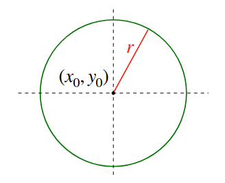
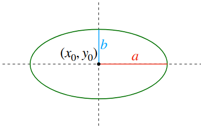
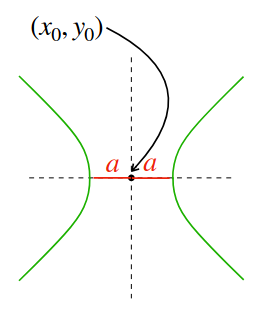
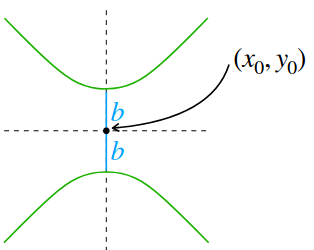

# Graficos Cheat Sheet

#### Circulo: $x^2 + y^2 = r^2$

---

### Elipse: $\frac{x^2}{a^2} + \frac{y^2}{b^2} = 1$

---

#### Parabola:

### $y = a{x^2} + bx + c$ | $x = a{y^2} + by + c$

---

#### Hiperbola:

### $\frac{x^2}{a^2} - \frac{y^2}{b^2} = 1$

### $-\frac{x^2}{a^2} + \frac{y^2}{b^2} = 1$

