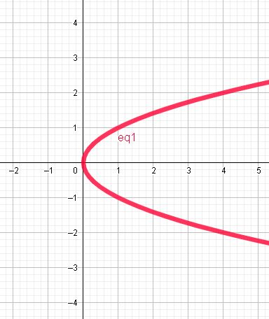
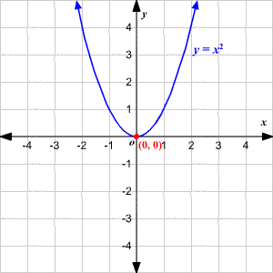

# Graficos Cheat Sheet

#### Circulo: $x^2 + y^2 = r^2$

---

#### Elipse: $\frac{x^2}{a^2} + \frac{y^2}{b^2} = 1$

---

#### Parabola:

### $x = y^2$

Lo mismo hacia la izquierda con $x = -y^2$

### $y = x^2$

Lo mismo hacia abajo con $y = -x^2$

---

#### Hiperbola:

### $\frac{x^2}{a^2} - \frac{y^2}{b^2} = 1$

### $-\frac{x^2}{a^2} + \frac{y^2}{b^2} = 1$

