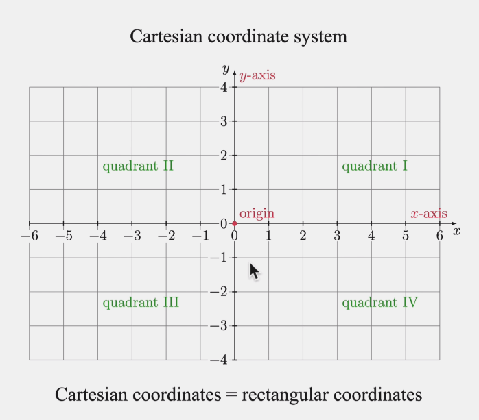
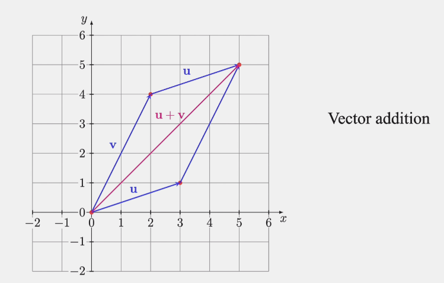
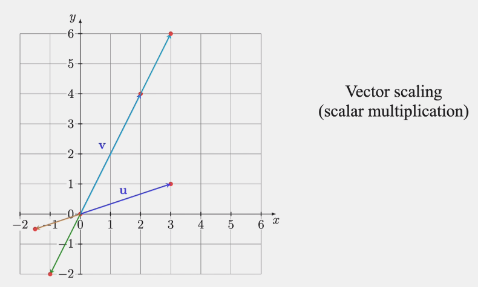

## The Plane $R^2$ and the 3-space $R^3$: points and vectors

$\vec V = (v_1, v_2)$

### Vector addition and subtraction

$u = (3, 1)$ and $v = (2, 4)$  
$u + v = (5, 5)$

### Vector scaling

Example: If $u = (3, 2)$ and $v = (2, 4)$ are two vector then

$-\frac12u = (-\frac32, -\frac12)$, $-\frac12v = (-1, -2)$, $\frac32v = (3, 6)$

## Distance between points
<!-- TODO: watch next class -->
